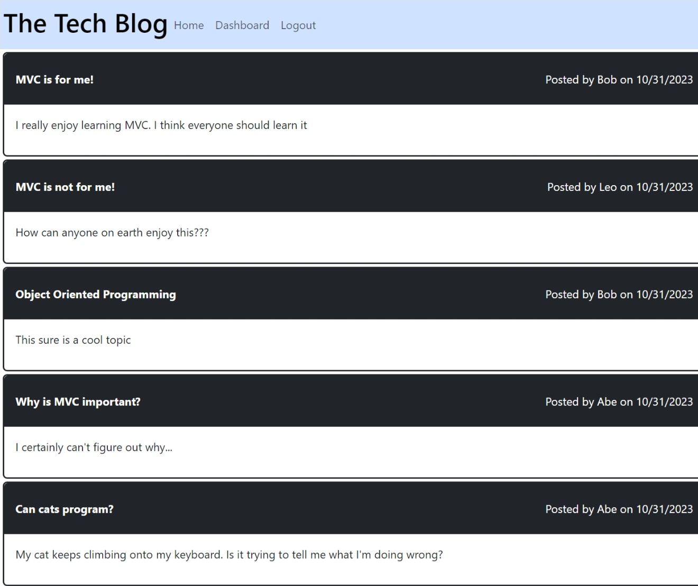
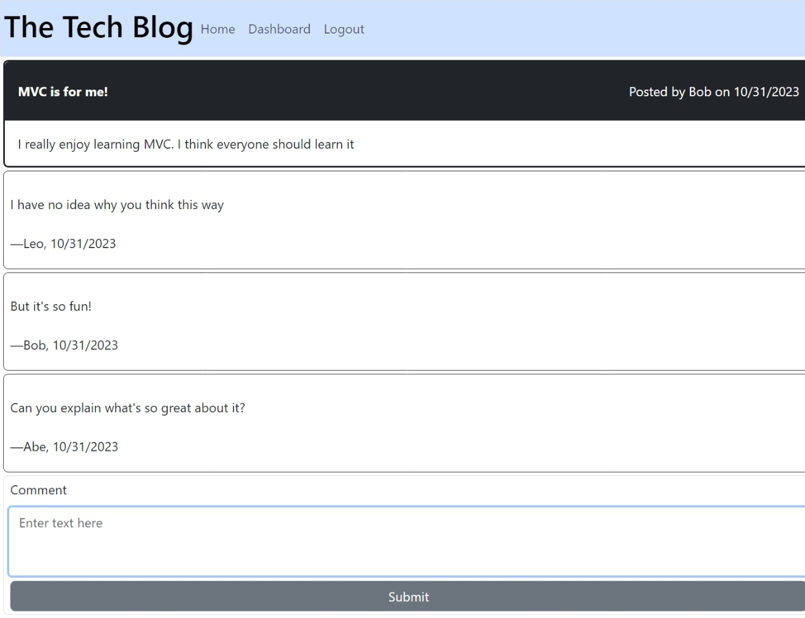

# Tech Blog

## Description

This project was designed as a blog-style website where users are able to publish text-based posts and comment on existing posts.  It was made as a way to practive the MVC architerctural structure, using Handlebars.js as the templating language, Sequelize as the ORM, and the express-session npm package for authentication. 

Link to site: [https://tech-talkers-e85792de0744.herokuapp.com/](https://tech-talkers-e85792de0744.herokuapp.com/)

## Usage

Upon entering the site, the user is directed to the homepage. On the homepage, users are able to see previously submitted posts, but to comment on a post or create a new post, they must first login or sign up.  

On the login page, if the user needs to sign up for a new account, they can click `Sign up instead` at the bottom of the page.  The user must enter a unique username and a password with at least 8 characters to login. Upon successful login or signup, the user is redirected to the homepage.

From the homepage, the user can click on any of the previously submitted posts to view that posts comments.

The user can enter text into the text area at the bottom of the page and then submit to comment on the post.

Users are able to create a new post using the `+ New post` button on their dashboard page. 

Then they can enter their desired title and content for their post and hit submit, or press cancel to return to their dashboard.  

Once submitted, the user's dashboard will contain a list of their previously submitted posts.

Users are able to edit or delete their previously submitted posts by clicking on them in the dashboard.

